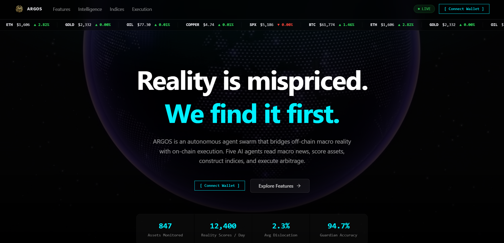

# ARGOS — Reality Arbitrage Engine

```
 █████╗ ██████╗  ██████╗  ██████╗ ███████╗
██╔══██╗██╔══██╗██╔════╝ ██╔═══██╗██╔════╝
███████║██████╔╝██║  ███╗██║   ██║███████╗
██╔══██║██╔══██╗██║   ██║██║   ██║╚════██║
██║  ██║██║  ██║╚██████╔╝╚██████╔╝███████║
╚═╝  ╚═╝╚═╝  ╚═╝ ╚═════╝  ╚═════╝ ╚══════╝
Reality Arbitrage Engine · v2.0
```

> **The world's first autonomous macro-to-on-chain intelligence system.**  
> An AI agent swarm that continuously monitors global macro reality, scores it with proprietary Reality Scores, constructs on-chain indices, and executes Guardian-approved trades — all with a cryptographic audit trail.  
> Built for the **SoSoValue Buildathon 2026**.


---

## 🔭 What is ARGOS?

ARGOS (Autonomous Reality Grounding and Orchestration System) bridges the gap between off-chain macro-economic reality and on-chain asset pricing. It quantifies macro dislocations as **Reality Scores** (0–100) and autonomously exploits them through structured index construction and Guardian-protected trade execution.

Think **Bloomberg Terminal** meets **autonomous DeFi agent swarm** — with every decision cryptographically attested on-chain.

---

## 🤖 The 5-Agent Swarm

```
MACRO REALITY
    │
    ▼
[THE SCRIBE] ──── SoSoValue Terminal API
    │               Structured news ingestion · Sentiment classification
    ▼
[THE ORACLE] ──── Reality Score Engine (0–100)
    │               Confidence-weighted scoring · Thesis + counterpoints
    ▼
[THE ARCHITECT] ── SSI Index Protocol
    │               Constituent weight optimization · ArgosIndex.sol deployment
    ▼
[THE EXECUTOR] ─── SoDEX Orderbook
    │               Guardian pre-approval gate · Slippage enforcement
    ▼
[THE GUARDIAN] ─── Risk Framework
    │               Circuit breakers · Adversarial debate · Halt controls
    ▼
[ARGOSAUDIT.SOL] ── Immutable on-chain attestation of every decision
```

| Agent | Role | Key Output |
|---|---|---|
| **The Scribe** | Ingests SoSoValue Terminal news | Classified macro signals |
| **The Oracle** | Generates Reality Scores | Score 0–100 + thesis + counterpoints |
| **The Architect** | Constructs SSI indices | On-chain index deployment |
| **The Executor** | Executes trades via SoDEX | Guardian-approved trade records |
| **The Guardian** | Risk management & intervention | Circuit breaker triggers + audit logs |

---

## 📜 Deployed Smart Contracts (Sepolia Testnet)

All three contracts are **live on Ethereum Sepolia** and fully wired into the frontend.

### ArgosAudit.sol
> Immutable on-chain attestation registry. Every agent decision is cryptographically hashed and attested here — permanent, verifiable, tamper-proof.

```
Network:  Sepolia
Address:  0x1C6d6d7222d9e16BF2B0DbCc3cD6aE4DF5CA1Eaa
Explorer: https://sepolia.etherscan.io/address/0x1C6d6d7222d9e16BF2B0DbCc3cD6aE4DF5CA1Eaa
```

### ArgosIndex.sol — CSSI (Copper Supply Shock Index)
> ERC-20 on-chain index token with constituent weights and AI-driven rebalancing signals. First of many SSI indices.

```
Network:  Sepolia
Address:  0x7471915D3f58Fac8F5f769A8f4cD63Af35753c68
Explorer: https://sepolia.etherscan.io/address/0x7471915D3f58Fac8F5f769A8f4cD63Af35753c68
```

Constructor args used:
```
_name:    "Copper Supply Shock Index"
_symbol:  "CSSI"
_weights: [40, 30, 20, 10]              // basis points
_assets:  ["COPPER","GOLD","OIL","BTC"] // constituents
```

### ArgosVault.sol
> Guardian-controlled execution vault. Records every trade on-chain with slippage data, execution price, and an audit hash linked back to ArgosAudit. Uses a `TradeInput` struct to avoid EVM stack-depth limits.

```
Network:  Sepolia
Address:  0xf32Cdb427e1Cf99A72BBE4Cf024798cb6FD06936
Explorer: https://sepolia.etherscan.io/address/0xf32Cdb427e1Cf99A72BBE4Cf024798cb6FD06936
```

Constructor args used:
```
_guardian:      <deployer wallet>
_executor:      <deployer wallet>
_auditContract: 0x1C6d6d7222d9e16BF2B0DbCc3cD6aE4DF5CA1Eaa
```

#### TradeInput Struct (ArgosVault)
```solidity
struct TradeInput {
    string  pair;        // e.g. "BTC/USDC"
    string  side;        // "BUY" | "SELL"
    uint256 amount;      // in wei
    uint256 price;       // oracle price (18 decimals)
    uint256 execPrice;   // actual execution price
    int256  slippageBps; // slippage in basis points
    string  status;      // "FILLED" | "PARTIAL" | "REJECTED"
}
```

---

## 🌐 Application Pages (10 Routes)

| Route | Page | Description |
|---|---|---|
| `/` | Landing | Live price ticker, agent manifesto, wallet CTA |
| `/dashboard` | War Room | Agent swarm visualization, opportunities, portfolio |
| `/intelligence` | Intelligence Feed | SoSoValue news + Oracle Reality Scores |
| `/indices` | Index Architect | SSI index construction + on-chain deployment |
| `/execution` | Execution Terminal | SoDEX orderbook, trade entry, slippage simulation |
| `/risk` | Guardian | Circuit breakers, adversarial red-team, interventions |
| `/audit` | Audit Trail | Cryptographic proof logs, "View Proof" viewer |
| `/whitepaper` | Technical Whitepaper | Full architecture + methodology |
| `/deploy` | Deploy Guide | Step-by-step Remix IDE contract deployment |
| `/download` | Download | Full project tarball |

---

## 🔌 Data Stack

| Source | Data | Key Required |
|---|---|---|
| **SoSoValue Terminal** | Macro news + SSI indices | `VITE_SOSOVALUE_API_KEY` |
| **CoinGecko** | BTC/ETH live prices | None (free) |
| **AlphaVantage** | GOLD, OIL, COPPER, SPX | `VITE_ALPHA_VANTAGE_KEY` |
| **GBM Price Engine** | Stochastic simulation baseline | None (built-in) |

---

## 🚀 Getting Started

### Prerequisites
- [Bun](https://bun.sh) installed
- Convex account (free at [convex.dev](https://convex.dev))

### Installation

```bash
# Clone and install
git clone <repo-url>
cd argos
bun install

# Start development server
bun run dev
```

### Environment Variables

Create a `.env.local` file:

```bash
# Convex (required)
CONVEX_DEPLOYMENT=your-deployment-id
VITE_CONVEX_URL=https://your-deployment.convex.cloud

# Live data (optional — falls back to mock data if not set)
VITE_SOSOVALUE_API_KEY=your-sosovalue-key     # Intelligence + Indices live data
VITE_ALPHA_VANTAGE_KEY=your-alphavantage-key  # GOLD, OIL, COPPER, SPX prices

# Smart contracts (already deployed on Sepolia — wire these in)
VITE_ARGOS_AUDIT_ADDRESS=0x1C6d6d7222d9e16BF2B0DbCc3cD6aE4DF5CA1Eaa
VITE_ARGOS_VAULT_ADDRESS=0xf32Cdb427e1Cf99A72BBE4Cf024798cb6FD06936
VITE_ARGOS_INDEX_CSSI=0x7471915D3f58Fac8F5f769A8f4cD63Af35753c68
```

---

## 📐 Reality Score Methodology

```
Reality Score = (
  sentiment_weight    × 0.35 +   // Bullish/Bearish/Neutral classification
  confidence_weight   × 0.25 +   // Model confidence in the signal
  dislocation_weight  × 0.25 +   // On-chain vs off-chain price divergence
  counterpoint_weight × 0.15     // Adversarial counterargument strength
) × 100
```

Scores above **70** trigger Architect index construction.  
Scores below **30** trigger Guardian circuit breaker evaluation.

---

## 🗂 Project Structure

```
src/
├── pages/
│   ├── Landing.tsx          # / — Public manifesto + live ticker
│   ├── Dashboard.tsx        # /dashboard — War Room
│   ├── Intelligence.tsx     # /intelligence — Oracle feed
│   ├── Indices.tsx          # /indices — Index Architect
│   ├── Execution.tsx        # /execution — Trade terminal
│   ├── Risk.tsx             # /risk — Guardian
│   ├── Audit.tsx            # /audit — Audit trail
│   ├── Whitepaper.tsx       # /whitepaper — Technical whitepaper
│   ├── Deploy.tsx           # /deploy — Contract deploy guide
│   └── Download.tsx         # /download — Project tarball
├── components/
│   └── argos/
│       ├── AppLayout.tsx    # Institutional shell + wallet gating
│       └── WalletConnect.tsx
├── lib/
│   ├── price-engine.ts      # GBM price engine + live anchors
│   ├── argos-mock.ts        # Deterministic mock data
│   ├── argos-types.ts       # Domain types
│   ├── sosovalue-api.ts     # SoSoValue API client
│   └── wagmi-config.ts      # Wagmi + wallet config
├── convex/
│   ├── schema.ts            # Database schema
│   ├── auth.ts              # Convex Auth
│   └── users.ts             # User management
public/
└── contracts/
    ├── ArgosAudit.sol       # Attestation registry
    ├── ArgosIndex.sol       # ERC-20 index token
    └── ArgosVault.sol       # Guardian-controlled vault
```

---

## 🛠 Tech Stack

| Layer | Technology |
|---|---|
| **Frontend** | React 19 + Vite + TypeScript |
| **Routing** | React Router v7 |
| **Styling** | Tailwind CSS v4 + shadcn/ui |
| **Animation** | Framer Motion |
| **Backend** | Convex (real-time database + functions) |
| **Auth** | Convex Auth + Wagmi wallet |
| **Wallet** | Wagmi + viem (MetaMask, WalletConnect) |
| **Charts** | Recharts |
| **Contracts** | Solidity 0.8.x (Sepolia) |
| **Package Manager** | Bun |

---

## 📜 Available Scripts

```bash
bun run dev          # Start development server
bun run build        # Build for production
bun run type-check   # TypeScript type checking
bun run preview      # Preview production build
```

---

## 🗺 Roadmap

| Phase | Milestone | Status |
|---|---|---|
| **Phase 1** | Core agent swarm (5 agents) | ✅ Complete |
| **Phase 1** | 10-page terminal UI | ✅ Complete |
| **Phase 1** | Smart contracts on Sepolia | ✅ Complete |
| **Phase 1** | SoSoValue Terminal integration | ✅ Complete |
| **Phase 2** | Uniswap V3 swap execution | 🔜 Planned |
| **Phase 2** | SIWE authentication + sessions | 🔜 Planned |
| **Phase 2** | Multi-network (Arbitrum, Base) | 🔜 Planned |
| **Phase 3** | Mainnet deployment | 🔮 Future |
| **Phase 3** | DAO governance for circuit breakers | 🔮 Future |
| **Phase 3** | Cross-chain index deployment | 🔮 Future |

---

## 📄 License

MIT — see [LICENSE](./LICENSE)

---

<div align="center">
  <strong>ARGOS · Reality Arbitrage Engine · SoSoValue Buildathon 2026</strong><br/>
  <em>Bridging macro reality with on-chain execution, one Reality Score at a time.</em>
</div>

Execution de
